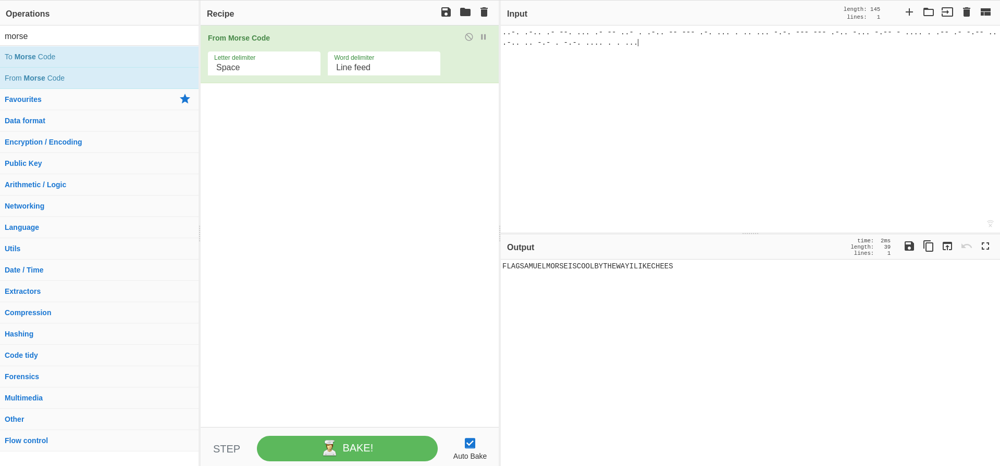

### CTF Statement:
```txt
..-. .-.. .- --. ... .- -- ..- . .-.. -- --- .-. ... . .. ... -.-. --- --- .-
.. -... -.-- - .... . .-- .- -.-- .. .-.. .. -.- . -.-. .... . . ...
```

---

Well, there's not much to go by except to decode the given morse code. To do this we can just use [Cyber Chef]() or any other similar script/tool(s).



---

#### The Flag:
    CTFLearn{FLAGSAMUELMORSEISCOOLBYTHEWAYILIKECHEES}

Link to the challenge: [Morse Code](https://ctflearn.com/challenge/309)
