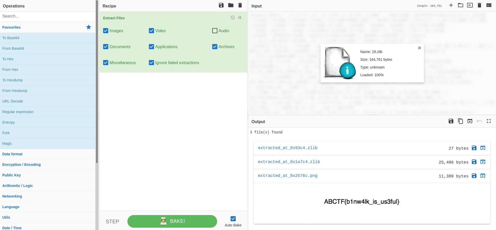

### CTF Statement:
```txt
Here is a file with another file hidden inside it. Can you extract it?

https://mega.nz/#!qbpUTYiK!-deNdQJxsQS8bTSMxeUOtpEclCI-zpK7tbJiKV0tXYY
```

_[File Link](https://mega.nz/#!qbpUTYiK!-deNdQJxsQS8bTSMxeUOtpEclCI-zpK7tbJiKV0tXYY)_

---

Following the link, we get an image: `PurpleThing.jpeg`.
As the ctf title suggests, we use [`binwalk`](https://linuxcommandlibrary.com/man/binwalk) to get the flag.
```zsh
$ binwalk PurpleThing.jpeg

DECIMAL       HEXADECIMAL     DESCRIPTION
--------------------------------------------------------------------------------
0             0x0             PNG image, 780 x 720, 8-bit/color RGBA, non-interlaced
41            0x29            Zlib compressed data, best compression
153493        0x25795         PNG image, 802 x 118, 8-bit/color RGBA, non-interlaced

# Extracting the files from the image:
$ binwalk -e PurpleThing.jpeg
... same stuff ...


$ ls _PurpleThing.jpeg.extracted
29  29.zlib
```

We can extract data from `29.zlib` using [`Cyber Chef`](https://gchq.github.io/CyberChef/)




And there's the flag! :D

---


#### The Flag:
    ABCTF{b1nw4lk_is_us3ful}


Link to the challenge: [Binwalk](https://ctflearn.com/challenge/348)
