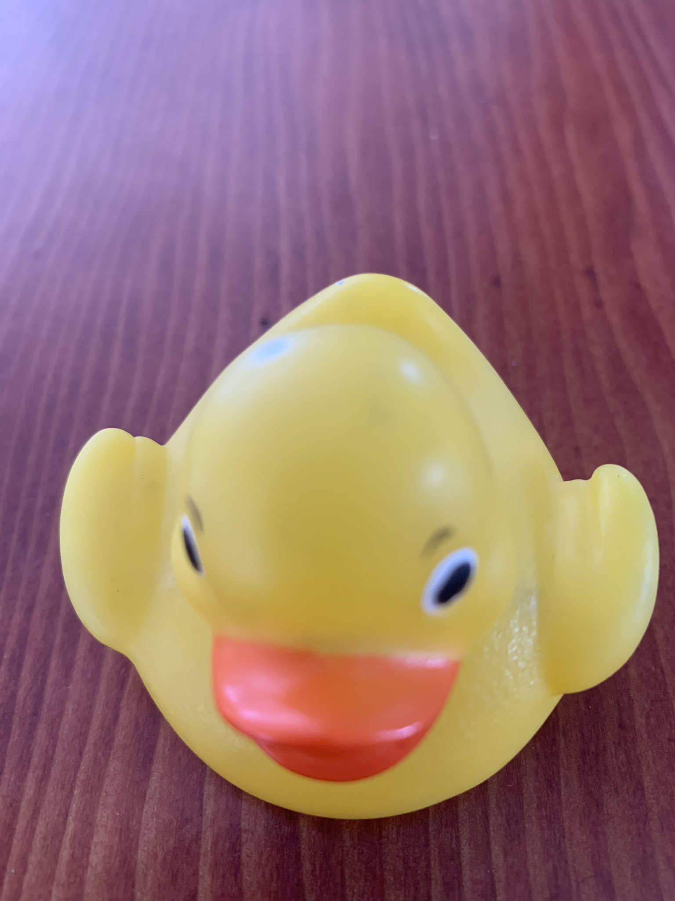

### CTF Statement:
```txt
Find the flag! Simple forensics challenge to get started with.
```

_[File Link](https://ctflearn.com/challenge/download/933)_

---

The link in the challenge discription gives us the following image:
<br>



<br>

We can extract the flag using the [`file`](https://linux.die.net/man/1/file) tool/command:

```zsh
file RubberDuck.jpg
RubberDuck.jpg: JPEG image data, JFIF standard 1.01, aspect ratio, density 72x72, segment length 16, comment: "CTFlearn{ILoveJakarta}", progressive, precision 8, 1536x2048, components
3
```


---

#### The Flag:
    CTFlearn{ILoveJakarta}

Link to the challenge: [Rubber Duck](https://ctflearn.com/challenge/933)
