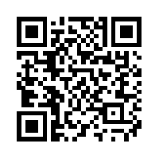

### CTF Statement:
```txt
Do you remember something known as QR Code?
Simple. Here for you : https://mega.nz/#!eGYlFa5Z!8mbiqg3kosk93qJCP-DBxIilHH2rf7iIVY-kpwyrx-0
```

---

Following the link, we get the following image:



<br>

To scan the given QR-code, we can use a tool like [`CoBang`](https://github.com/hongquan/CoBang)


The resultant text extracted after scanning is: `c3ludCB2ZiA6IGEwX29icWxfczBldHJnX2RlX3BicXI=`

Clearly, this is base64 encoded, so we can decode it like so:

```zsh
$ echo "c3ludCB2ZiA6IGEwX29icWxfczBldHJnX2RlX3BicXI=" | base64 --decode
synt vf : a0_obql_s0etrg_de_pbqr
```

The result doesn't make any sense at first, but upon further inspection, it's clear that it's some kind of ROT encryption. A generic ROT13 decryption seems to reveal the flag.

We can simply use [`Cyber Chef`](https://gchq.github.io/CyberChef/) to decode the flag :)


```
Input:
    synt vf : a0_obql_s0etrg_de_pbqr

Output:
    flag is : n0_body_f0rget_qr_code
```
---


#### The Flag:
    CTFLearn{n0_body_f0rget_qr_code}


Link to the challenge: [QR Code](https://ctflearn.com/challenge/228)
